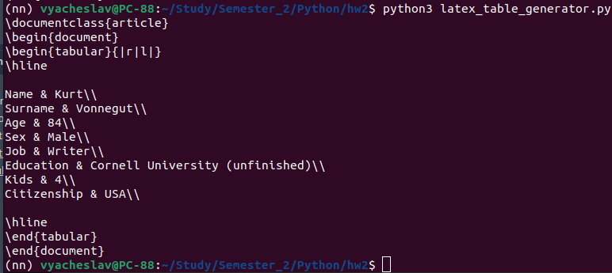
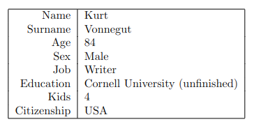
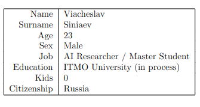
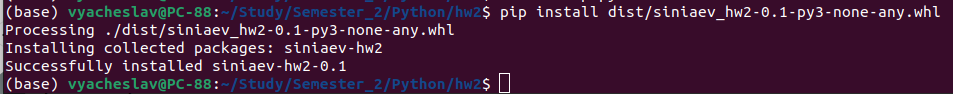

# Latex creating

Solving tasks on creating files in LaTeX format

## Contents
- [Creating table](#creating-table)
- [Creating PDF](#creating-pdf)
- [Docker](#docker)

### Creating table
**Task:** 

Write a function to generate tables. You cannot use third-party libraries to generate LaTeX. The input is a double list, the output is a string with a formatted valid LaTeX. You can check that LaTeX is valid, for example, in *Overleaf*. Using another module (`.py` file) you need to import your function and using it you need to save it to a `.tex` file example 

**Usage:**

- `python3 latex_generator.py` - You can use this script to check function in your terminal.
- `python3 latex_filemaker.py` - You can use this script to create a LaTeX table in your directory.

- 
**Example of working:**
  

You can see the results of the programmes below.
The resulting LaTeX was simply pasted on the Overleaf website.

### Creating PDF

**Task:**

Write a function to generate pictures in LaTeX. (In the same module as the previous function).
Use any picture (png file) as a picture, BUT:
- You need to build your code into a library using setuptools/conda-build, put it in the repository
- Install your library.
- Then, using your library, generate a PDF with the table from task 2.1 and a picture using the resulting Latex. The PDF is the first artifact of the task, the link to the repository in PyPI/Anaconda is the second.

**Usage:**

`python3 latex_filemaker.py` - You can use this script to create a LaTeX table and pdf table in your directory.

**Example of working:**

File `table.pdf` in the "artifacts" folder. I decided not to add my library to anaconda so as not to clog it up, but here is the output of the local connection of my library:

### Docker

**Task:**
Most likely, for task 2.2 you have installed some binary dependencies of LaTeX by hand. If another developer wants to reuse your code, he will have to do the same. To avoid this, Docker is usually used. 
The goal is to write a Dockerfile that will install the dependencies, run your code (to generate the .tex), and then generate the pdf.
The artifact will be the Dockerfile itself, you can leave it in the hw02 folder

**Result:**

`Dockerfile` is in the "artifacts" folder
